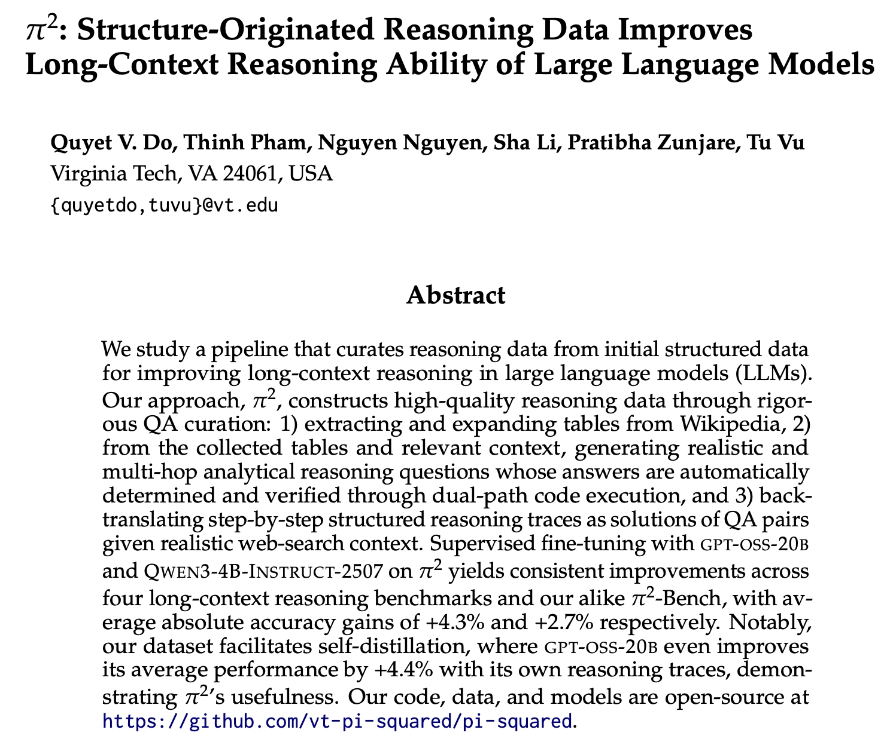
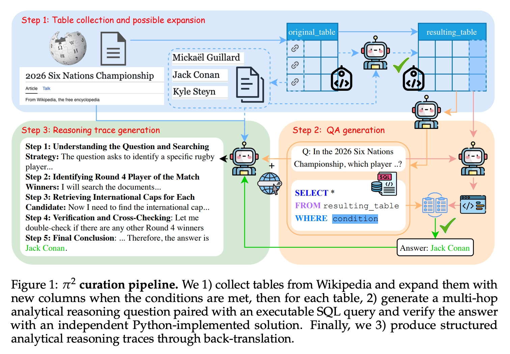
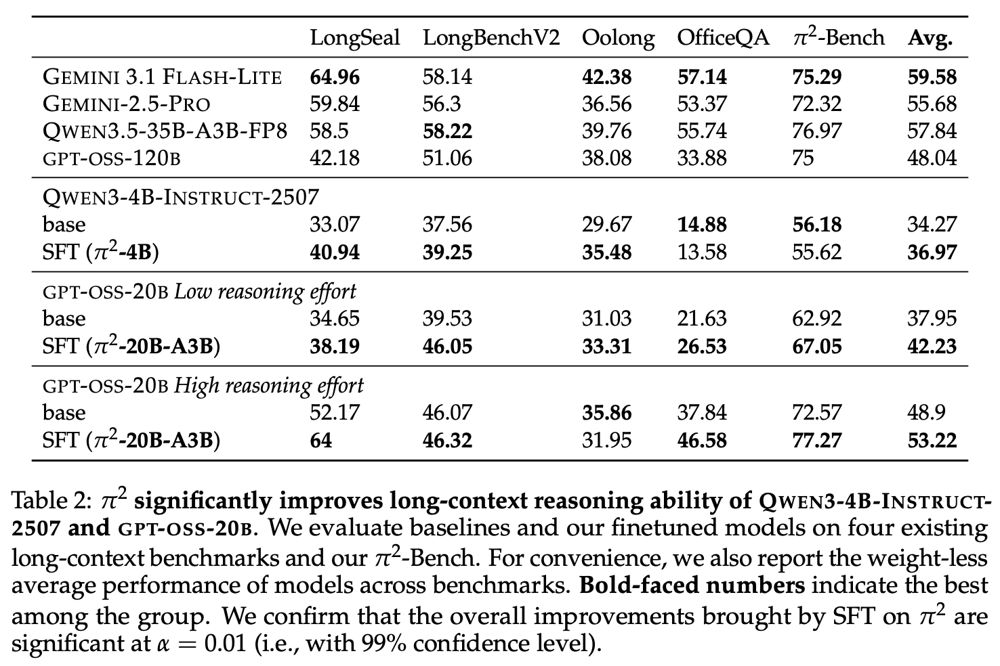

<h1 align="center" style="font-size:2.8em">
<span>$\pi^2$: Structure-Originated Reasoning Data Improves Long-Context Reasoning Ability of Large Language Models</span>
</h1>

<p align="center" style="font-size:1.3em">
  <a href="https://arxiv.org/abs/2604.05114">Full Paper</a>
</p>

<p align="center">
  
  
  
</p>


## Overview

We introduce $\pi^2$ (in plain text, Pi^2), a pipeline that 1) transforms Wikipedia tables into high-quality multi-document multi-hop QA data and 2) back-translates long-context reasoning traces from that.

Key takeaways:
➡️ Fine-tuning with 1k generated reasoning traces yields consistent improvements across 4 long-context benchmarks + our new Pi^2-Bench (gpt-oss-20b: +4.3% avg gain; Qwen3-4B-Instruct: +2.7% avg gain)
➡️ Fine-tuned models are competitive with proprietary and larger models
➡️ Self-distillation works: gpt-oss-20b improves +4.4% using its own reasoning traces


## Resources

We are working hard to release the following resources:

- [x] Training data
    - [ ] Available on HF 🤗
- [ ] Models on HF 🤗
- [ ] Data pipeline code


## Training data

We first serve our training data via Google Drive. It is the reasoning traces data for finetuning LLMs on long-context reasoning:
    - [Reasoning traces generated by gpt-oss-120b](https://drive.google.com/file/d/1hUHyNX-2qTPLxe9ennsOMRHiAdBXp5fo/view?usp=sharing)
    - [Reasoning traces generated by Qwen3.5-35B-A3B](https://drive.google.com/file/d/17s_pJEFFirXi8Wywyqc4D3Nm1XhKTFIr/view?usp=sharing)

The two files are in JSONL format. Each line contains many data fields that reflect our data generation process (more elaboration later). Key data fields for finetuning for long-context reasoning are:
```python
{
    "context": "An unstructured text context retrieved from web search, containing evidences for answering the question",
    "question": "Generated question by our Pi^2 pipeline",
    "llm_generated_reasoning_traces": "Generated reasoning traces by the teacher LLM",
    "final_answer_sql": "Verified answer"
}
```


## Bibtex

If you find our data, models, or code helpful, please consider citing our paper:

```bibtex
@misc{do2026pi2,
      title={$\pi^2$: Structure-Originated Reasoning Data Improves Long-Context Reasoning Ability of Large Language Models}, 
      author={Quyet V. Do and Thinh Pham and Nguyen Nguyen and Sha Li and Pratibha Zunjare and Tu Vu},
      year={2026},
      eprint={2604.05114},
      archivePrefix={arXiv},
      primaryClass={cs.CL},
      url={https://arxiv.org/abs/2604.05114}, 
}
```
